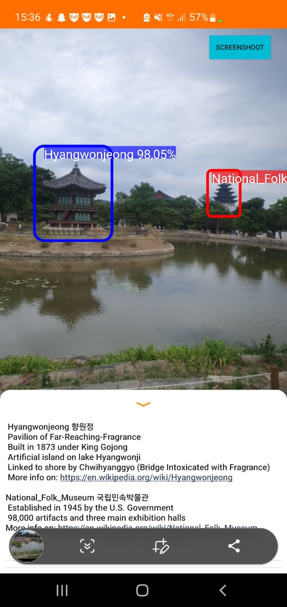
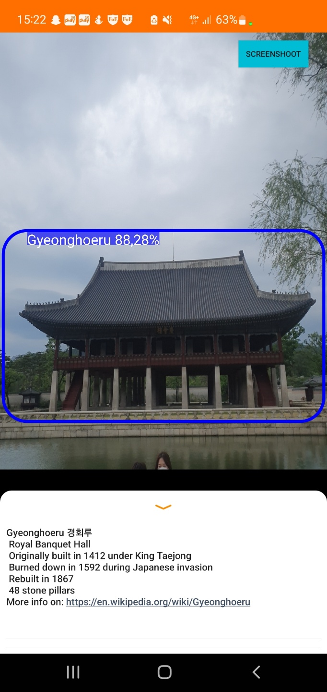
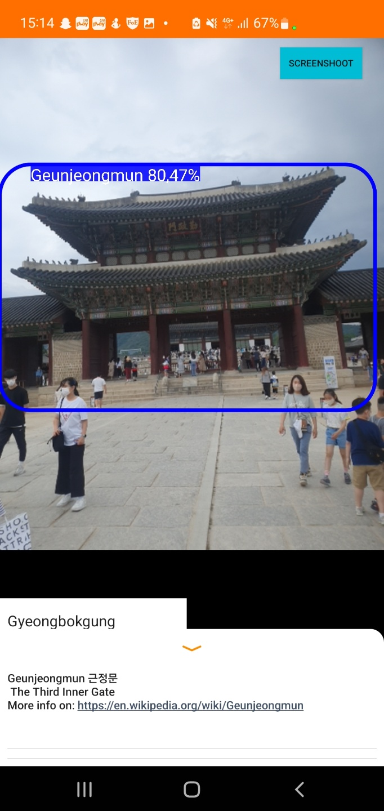

# Deep Tour

## Table of content
- [Table of content](#table-of-content)
- [Motivation](#motivation)
_ [Description](#description)  
- [Demo](#demo)  
- [Installation guide](#installation-guide)
- [Project Plan](#project-plan) 
- [YOLO & Label Studio](#yolo--label-studio)
- [How to contribute](#how-to-contribute)
- [Authors](#Authors)

## Motivation
Flyers are the most common way to get information on the landmark you’re visiting, but you never know what to do with the flyer afterwards.
Wikipedia is weightless and more detailed but has fewer links to the actual landmark (where is what ? What is what?)
Moreover, the mentioned things are not interactive. 
Our project, DeepTour, solves the described problems

## Description
Using small context dependent CNNs, we provide an interactive experience for specific landmarks.
The application is scalable and lightweight and respects your privacy:
1) A data pipeline built on Google Cloud platform makes it extremely easy to add new models to the library
2) The landmark specific approach allows smaller training sets and models 
3) Even devices with low camera resolution can run the app
4) The models size allows to run them offline without latency
5) The camera feed is not recorded
   

## Demo

## Installation guide
1. Clone the repository
2. Install [Android Studio](https://developer.android.com/studio)
3. Create the project from the repository
4. Plug in the mobile device on which you want to run the application
5. Run the project

## Project Plan

- https://docs.google.com/spreadsheets/d/19iuFGRteMb3kAu80RROosaV1PEw5H7rn0NWL_G-rLo4/edit#gid=0

## YOLO & Label Studio

- https://pjreddie.com/darknet/yolo/
- https://labelstud.io/blog/Quickly-Create-Datasets-for-Training-YOLO-Object-Detection.html

## How to contribute
If you find any bug or have suggestion on improvement, you can:
1. Fork the server or the bot repository, make the changes and then create a pull request
2. Open the issue with the description of the bug/suggestion

## Authors
Andrei Palaev  
Norman Doret  
Yohan Lang
